# Звіт з лабораторної роботи 3. Модифікація даних та транзакції

**Виконав:** Чернік Михайло
**Група:** ІПЗ-31
**Дата виконання:** 13 листопада 2025 року
**Варіант:** Система управління бібліотекою

## Мета роботи

Здобути практичні навички безпечної модифікації даних у реляційних базах даних, опанувати механізми транзакцій для забезпечення цілісності даних, навчитися працювати з обмеженнями цілісності та каскадними операціями при зміні взаємопов'язаних записів.

## Виконання роботи

### Рівень 1. Базові операції модифікації

#### Крок 1. Створення структури бази даних

Створено базу даних для системи управління бібліотекою з чотирма основними таблицями.

```sql
CREATE DATABASE library_lab3;
```

**Таблиця авторів з обмеженнями:**

```sql
CREATE TABLE authors (
    author_id SERIAL PRIMARY KEY,
    first_name VARCHAR(50) NOT NULL,
    last_name VARCHAR(50) NOT NULL,
    birth_year INTEGER CHECK (birth_year >= 1000 AND birth_year <= EXTRACT(YEAR FROM CURRENT_DATE)),
    country VARCHAR(50),
    created_at TIMESTAMP DEFAULT CURRENT_TIMESTAMP
);
```

Обмеження таблиці authors:
- PRIMARY KEY на author_id забезпечує унікальність кожного автора.
- NOT NULL на іменах запобігає створенню анонімних авторів.
- CHECK на birth_year обмежує діапазон коректних років народження.

**Таблиця книг з розширеними обмеженнями:**

```sql
CREATE TABLE books (
    book_id SERIAL PRIMARY KEY,
    isbn VARCHAR(17) UNIQUE NOT NULL,
    title VARCHAR(200) NOT NULL,
    author_id INTEGER NOT NULL,
    publication_year INTEGER CHECK (publication_year >= 1450),
    genre VARCHAR(50),
    total_copies INTEGER DEFAULT 1 CHECK (total_copies >= 0),
    available_copies INTEGER DEFAULT 1 CHECK (available_copies >= 0),
    created_at TIMESTAMP DEFAULT CURRENT_TIMESTAMP,
    FOREIGN KEY (author_id) REFERENCES authors(author_id) ON DELETE RESTRICT,
    CHECK (available_copies <= total_copies)
);
```

Ключові обмеження:
- UNIQUE на isbn гарантує відсутність дублікатів книг.
- FOREIGN KEY з ON DELETE RESTRICT запобігає видаленню авторів, у яких є книги.
- CHECK для available_copies <= total_copies забезпечує логічну консистентність.

**Таблиця читачів:**

```sql
CREATE TABLE readers (
    reader_id SERIAL PRIMARY KEY,
    first_name VARCHAR(50) NOT NULL,
    last_name VARCHAR(50) NOT NULL,
    email VARCHAR(100) UNIQUE NOT NULL,
    phone VARCHAR(20),
    library_card_number VARCHAR(20) UNIQUE NOT NULL,
    registration_date DATE DEFAULT CURRENT_DATE,
    status VARCHAR(20) DEFAULT 'Active' CHECK (status IN ('Active', 'Blocked', 'Inactive'))
);
```

**Таблиця видач:**

```sql
CREATE TABLE lendings (
    lending_id SERIAL PRIMARY KEY,
    book_id INTEGER NOT NULL,
    reader_id INTEGER NOT NULL,
    lending_date DATE DEFAULT CURRENT_DATE,
    due_date DATE NOT NULL,
    return_date DATE,
    FOREIGN KEY (book_id) REFERENCES books(book_id) ON DELETE RESTRICT,
    FOREIGN KEY (reader_id) REFERENCES readers(reader_id) ON DELETE RESTRICT,
    CHECK (due_date > lending_date),
    CHECK (return_date IS NULL OR return_date >= lending_date)
);
```

**Результат створення структури:**

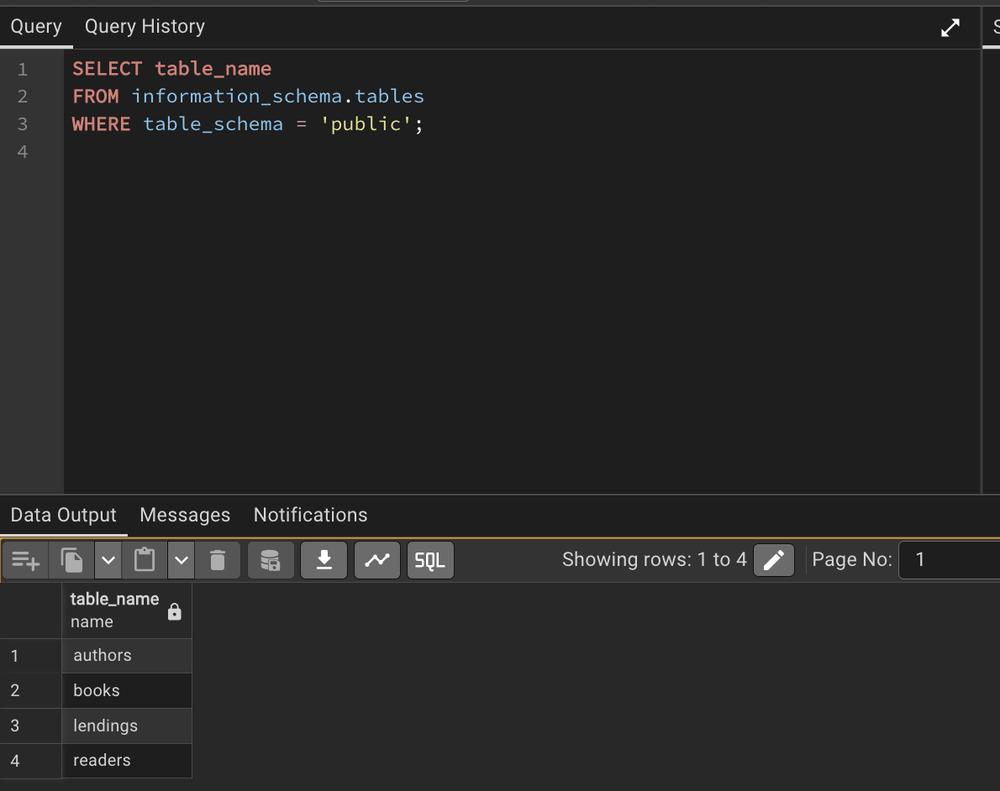

#### Крок 2. Додавання тестових даних

Виконано вставку початкових даних у всі створені таблиці.

**Додавання авторів:**

```sql
INSERT INTO authors (first_name, last_name, birth_year, country)
VALUES
    ('Тарас', 'Шевченко', 1814, 'Україна'),
    ('Іван', 'Франко', 1856, 'Україна'),
    ('Леся', 'Українка', 1871, 'Україна'),
    ('Михайло', 'Коцюбинський', 1864, 'Україна'),
    ('Панас', 'Мирний', 1849, 'Україна');
```

**Результат вставки:**

```
INSERT 4
```

**Перевірка доданих авторів:**

```sql
SELECT * FROM authors ORDER BY birth_year;
```

"author_id"	"first_name"	"last_name"	"birth_year"	"country"	"created_at"
1	"Тарас"	"Шевченко"	1814	"Україна"	"2025-11-20 14:13:48.052655"
5	"Панас"	"Мирний"	1849	"Україна"	"2025-11-20 14:13:48.052655"
2	"Іван"	"Франко"	1856	"Україна"	"2025-11-20 14:13:48.052655"
4	"Михайло"	"Коцюбинський"	1864	"Україна"	"2025-11-20 14:13:48.052655"
3	"Леся"	"Українка"	1871	"Україна"	"2025-11-20 14:13:48.052655"
**Додавання книг:**

```sql
INSERT INTO books (isbn, title, author_id, publication_year, genre, total_copies, available_copies)
VALUES
    ('978-966-03-4561-2', 'Кобзар', 1, 1840, 'Поезія', 10, 8),
    ('978-966-03-4562-9', 'Захар Беркут', 2, 1883, 'Історична проза', 5, 4),
    ('978-966-03-4563-6', 'Лісова пісня', 3, 1911, 'Драма', 7, 7),
    ('978-966-03-4564-3', 'Тіні забутих предків', 4, 1911, 'Повість', 6, 5),
    ('978-966-03-4565-0', 'Хіба ревуть воли, як ясла повні', 5, 1880, 'Повість', 4, 4);
```

**Додавання читачів:**

```sql
INSERT INTO readers (first_name, last_name, email, phone, library_card_number)
VALUES
    ('Олена', 'Петренко', 'olena.petrenko@email.com', '+380501234567', 'LIB-2024-001'),
    ('Андрій', 'Коваленко', 'andrii.kovalenko@email.com', '+380502345678', 'LIB-2024-002'),
    ('Марія', 'Сидоренко', 'maria.sydorenko@email.com', '+380503456789', 'LIB-2024-003'),
    ('Іван', 'Мельник', 'ivan.melnyk@email.com', '+380504567890', 'LIB-2024-004');
```

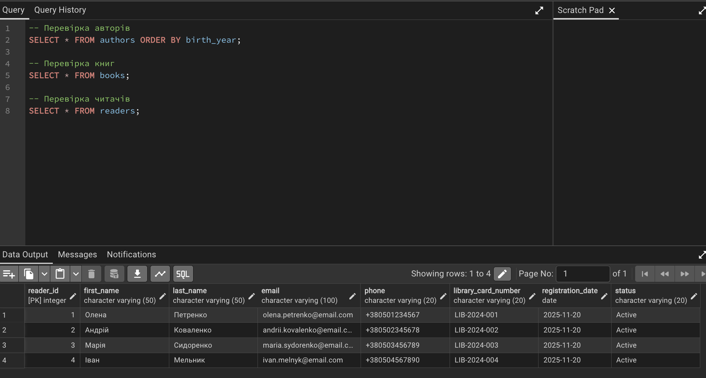

#### Крок 3. Безпечне оновлення записів

Продемонстровано важливість перевірки перед оновленням.

**Перевірка поточного стану:**

```sql
SELECT book_id, title, total_copies, available_copies
FROM books
WHERE book_id = 1;
```

**Результат перевірки:**

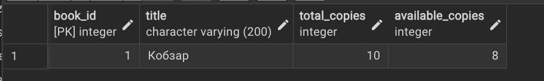

**Безпечне оновлення з умовою:**

```sql
UPDATE books
SET available_copies = available_copies - 1
WHERE book_id = 1 AND available_copies > 0;
```

**Результат:**

```
UPDATE 1
```

**Перевірка після оновлення:**

```sql
SELECT book_id, title, total_copies, available_copies
FROM books
WHERE book_id = 1;
```

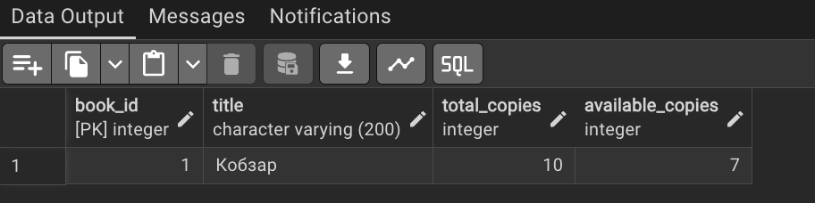

**Важливість умови WHERE:**

Для демонстрації небезпеки оновлення без WHERE створено тестову ситуацію:

```sql
-- Спочатку перевірка скільки записів буде змінено
SELECT COUNT(*) FROM books WHERE genre = 'Поезія';
```

Результат: 1 запис

```sql
-- Безпечне оновлення тільки для поезії
UPDATE books
SET total_copies = total_copies + 2
WHERE genre = 'Поезія';
```

Якби не було WHERE, оновилися б всі книги в таблиці.

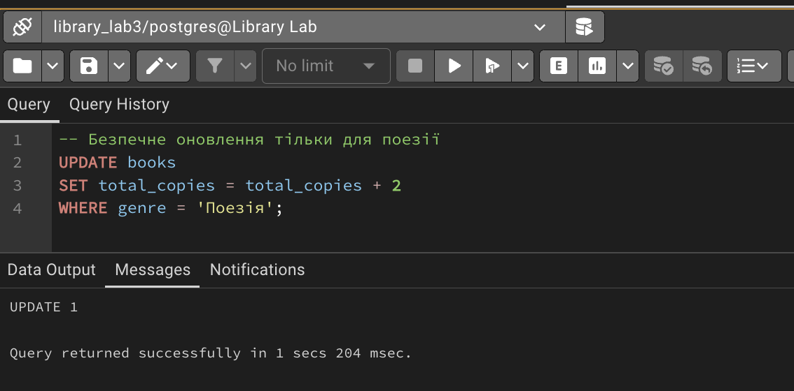

#### Крок 4. Операції з транзакціями

Реалізовано процес видачі книги як атомарну операцію.

**Транзакція видачі книги:**

```sql
BEGIN;

-- Додаємо запис про видачу
INSERT INTO lendings (book_id, reader_id, due_date)
VALUES (1, 1, CURRENT_DATE + INTERVAL '14 days')
RETURNING lending_id, book_id, reader_id, due_date;
```

**Результат INSERT:**

| lending_id | book_id | reader_id | due_date |
|------------|---------|-----------|----------|
| 1          | 1       | 1         | 2025-12-04 |

```sql
-- Зменшуємо кількість доступних примірників
UPDATE books
SET available_copies = available_copies - 1
WHERE book_id = 1 AND available_copies > 0
RETURNING book_id, title, available_copies;
```

**Результат UPDATE:**

| book_id | title | available_copies |
|---------|-------|------------------|
| 1       | Кобзар| 6                |

```sql
-- Перевірка коректності операцій
SELECT l.lending_id, b.title, r.first_name, r.last_name, l.due_date
FROM lendings l
JOIN books b ON l.book_id = b.book_id
JOIN readers r ON l.reader_id = r.reader_id
WHERE l.lending_id = 1;
```

**Результат перевірки:**

| lending_id | title | first_name | last_name | due_date |
|------------|-------|------------|-----------|----------|
| 1          | Кобзар| Олена      | Петренко  | 2025-12-04|

```sql
-- Підтверджуємо транзакцію
COMMIT;
```

**Результат:**

```
COMMIT
```

**Аналіз транзакції:**

Транзакція забезпечила атомарність операції видачі книги. Обидві операції (додавання запису в lendings та зменшення available_copies) виконалися як єдине ціле. Якби одна з операцій завершилася помилкою, обидві були б скасовані завдяки механізму транзакцій.

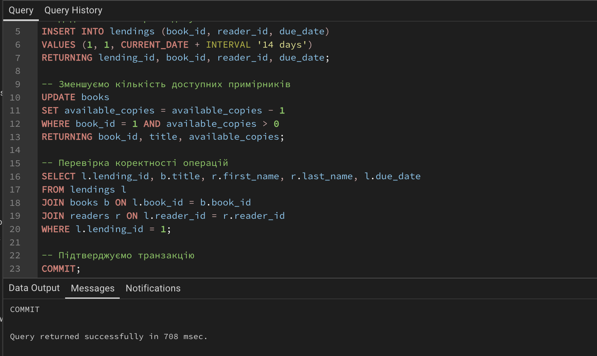

#### Крок 5. Демонстрація ROLLBACK

Показано відкат транзакції при виникненні помилки.

**Спроба видалення автора з книгами:**

```sql
BEGIN;

-- Перевірка чи є книги автора
SELECT book_id, title FROM books WHERE author_id = 1;
```

| book_id | title |
|---------|-------|
| 1       |Кобзар|

```sql
-- Спроба видалення автора
DELETE FROM authors WHERE author_id = 1;
```

**Результат:**

```
ERROR:  update or delete on table "authors" violates foreign key constraint "books_author_id_fkey" on table "books"
Key (author_id)=(1) is still referenced from table "books". 

SQL state: 23503
Detail: Key (author_id)=(1) is still referenced from table "books".".
```

Транзакція автоматично перейшла в стан помилки через порушення обмеження FOREIGN KEY.

```sql
-- Відкат транзакції
ROLLBACK;
```

**Перевірка що дані не змінилися:**

```sql
SELECT * FROM authors WHERE author_id = 1;
```

| author_id | first_name | last_name | birth_year | country |      created_ad            |
|-----------|------------|-----------|------------|---------|----------------------------|
| 1         | Тарас      | Шевченко  | 1814       | Україна | 2025-11-20 14:13:48.052655 |

**Висновок:**

Обмеження ON DELETE RESTRICT працює коректно та запобігає видаленню авторів, у яких є книги в системі. Механізм ROLLBACK дозволив повернути базу даних до стану до початку транзакції.

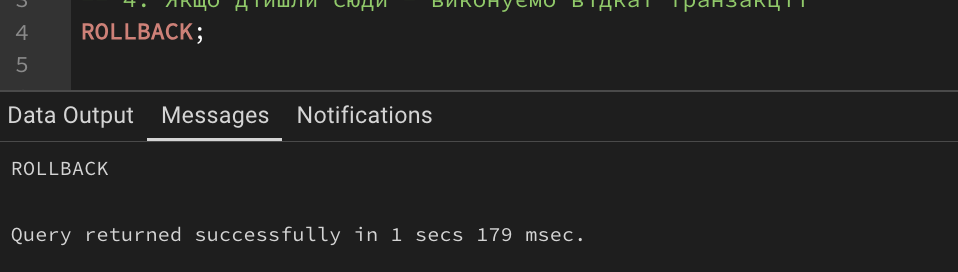

#### Крок 6. Безпечне видалення

Виконано видалення з попередньою перевіркою впливу на пов'язані дані.

**Перевірка читачів без активних видач:**

```sql
SELECT r.reader_id, r.first_name, r.last_name, r.status,
       COUNT(l.lending_id) as active_lendings
FROM readers r
LEFT JOIN lendings l ON r.reader_id = l.reader_id AND l.return_date IS NULL
GROUP BY r.reader_id, r.first_name, r.last_name, r.status
HAVING COUNT(l.lending_id) = 0 AND r.status = 'Inactive';
```

**Результат:**

```
(0 rows)
```

Жодного читача зі статусом Inactive без активних видач не знайдено.

**Створення тестового читача для видалення:**

```sql
INSERT INTO readers (first_name, last_name, email, library_card_number, status)
VALUES ('Тестовий', 'Читач', 'test@example.com', 'LIB-TEST-001', 'Inactive')
RETURNING reader_id;
```

| reader_id |
|-----------|
|     5     |

**Безпечне видалення:**

```sql
DELETE FROM readers
WHERE status = 'Inactive'
  AND reader_id NOT IN (
      SELECT DISTINCT reader_id
      FROM lendings
      WHERE return_date IS NULL
  )
RETURNING reader_id, first_name, last_name;
```

**Результат:**

| reader_id | first_name | last_name |
|-----------|------------|-----------|
|     5     |  Тестовий  |   Читач   |

```
DELETE 1
```

**Перевірка:**

```sql
SELECT COUNT(*) FROM readers WHERE reader_id = 5;
```

Результат: 0

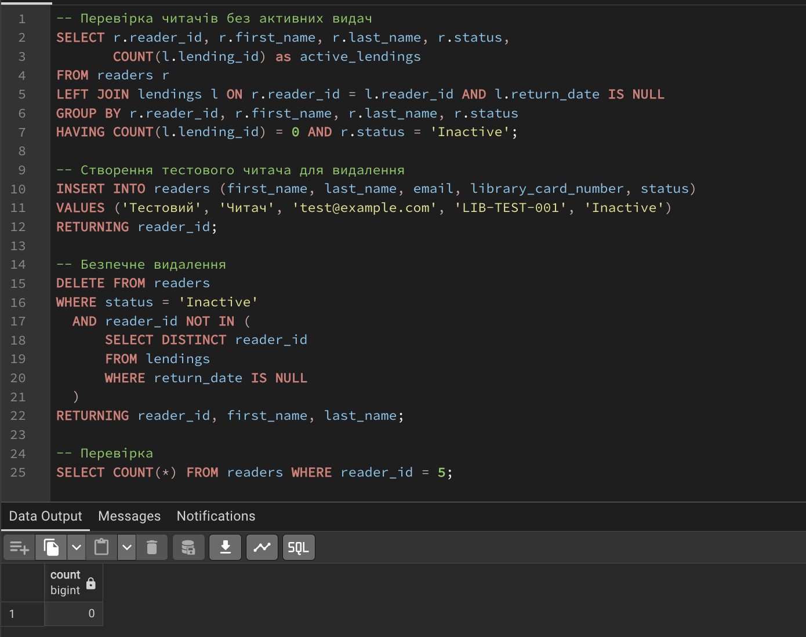

### Рівень 2. Розширена функціональність

#### Крок 1. Додавання нових таблиць

Створено додаткові таблиці для бронювань та аудиту змін.

**Таблиця бронювань:**

```sql
CREATE TABLE reservations (
    reservation_id SERIAL PRIMARY KEY,
    book_id INTEGER NOT NULL,
    reader_id INTEGER NOT NULL,
    reservation_date TIMESTAMP DEFAULT CURRENT_TIMESTAMP,
    expiration_date TIMESTAMP NOT NULL,
    status VARCHAR(20) DEFAULT 'Active' CHECK (status IN ('Active', 'Fulfilled', 'Cancelled', 'Expired')),
    FOREIGN KEY (book_id) REFERENCES books(book_id) ON DELETE CASCADE,
    FOREIGN KEY (reader_id) REFERENCES readers(reader_id) ON DELETE CASCADE
);
```

**Таблиця логування змін:**

```sql
CREATE TABLE audit_log (
    log_id SERIAL PRIMARY KEY,
    table_name VARCHAR(50) NOT NULL,
    operation VARCHAR(10) NOT NULL,
    record_id INTEGER NOT NULL,
    old_data JSONB,
    new_data JSONB,
    changed_at TIMESTAMP DEFAULT CURRENT_TIMESTAMP,
    changed_by VARCHAR(100) DEFAULT CURRENT_USER
);
```

**Тестування структури:**

```sql
-- Інформація про таблиці
SELECT table_name, column_name, data_type, is_nullable
FROM information_schema.columns
WHERE table_name IN ('reservations', 'audit_log')
ORDER BY table_name, ordinal_position;
```

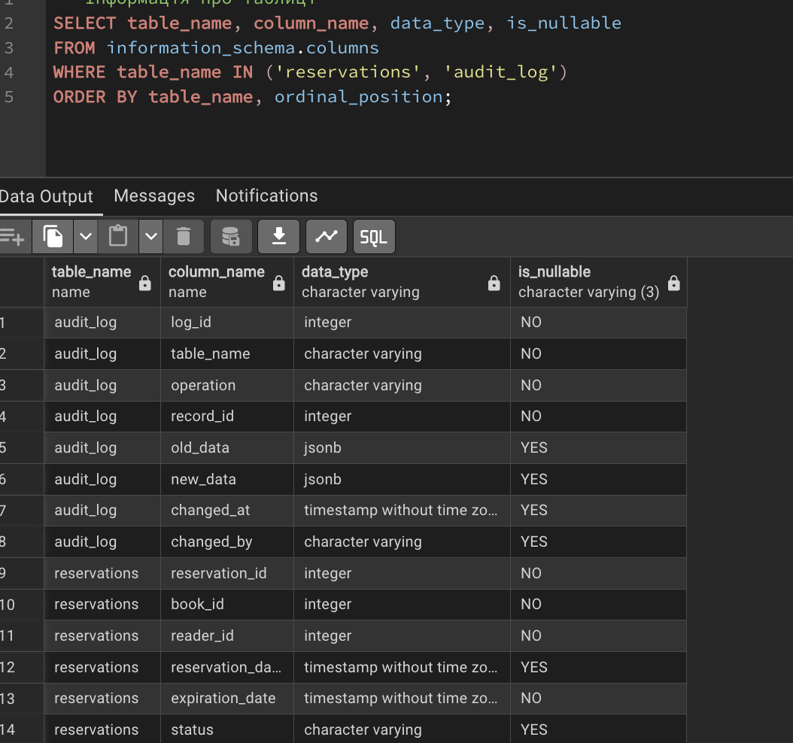

#### Крок 2. Складні транзакції

Реалізовано процес повернення книги з оновленням кількох таблиць.

**Підготовка тестових даних:**

```sql
-- Створюємо бронювання на книгу
INSERT INTO reservations (book_id, reader_id, expiration_date)
VALUES (1, 2, CURRENT_TIMESTAMP + INTERVAL '3 days');
```

**Транзакція повернення книги:**

```sql
BEGIN;

-- Крок 1: Оновлюємо запис про видачу
UPDATE lendings
SET return_date = CURRENT_DATE
WHERE lending_id = 1 AND return_date IS NULL
RETURNING lending_id, book_id, reader_id, return_date;
```

**Результат:**

| lending_id | book_id | reader_id | return_date |
|------------|---------|-----------|-------------|
|     1.     |    1.   |.    1     | 2025-11-20  |

```sql
-- Крок 2: Збільшуємо кількість доступних примірників
UPDATE books
SET available_copies = available_copies + 1
WHERE book_id = (SELECT book_id FROM lendings WHERE lending_id = 1)
RETURNING book_id, title, available_copies;
```

**Результат:**

| book_id | title | available_copies |
|---------|-------|------------------|
|.  1     | Кобзар|       6.         |

```sql
-- Крок 3: Перевіряємо активні бронювання
SELECT reservation_id, reader_id, reservation_date
FROM reservations
WHERE book_id = 1
  AND status = 'Active'
ORDER BY reservation_date
LIMIT 1;
```

**Результат:**

| reservation_id | reader_id | reservation_date           |
|----------------|-----------|----------------------------|
|      1.        |     2     | 2025-11-20 19:15:20.728906 |

```sql
-- Крок 4: Виконуємо бронювання
UPDATE reservations
SET status = 'Fulfilled'
WHERE reservation_id = 1
RETURNING reservation_id, status;
```

**Результат:**

| reservation_id | status    |
|----------------|-----------|
|.      1        | Fulfilled |

```sql
-- Підтверджуємо всі зміни
COMMIT;
```

**Перевірка результату:**

```sql
SELECT
    l.lending_id,
    b.title,
    r1.first_name || ' ' || r1.last_name as borrower,
    l.return_date,
    r2.first_name || ' ' || r2.last_name as next_reader,
    res.status as reservation_status
FROM lendings l
JOIN books b ON l.book_id = b.book_id
JOIN readers r1 ON l.reader_id = r1.reader_id
LEFT JOIN reservations res ON b.book_id = res.book_id AND res.reservation_id = 1
LEFT JOIN readers r2 ON res.reader_id = r2.reader_id
WHERE l.lending_id = 1;
```

**Результат:**

| lending_id | title |    borrower    | return_date |   next_reader    | reservation_status |
|------------|-------|----------------|-------------|------------------|--------------------|
|.   1       | Кобзар| Олена Петренко | 2025-11-20  | Андрій Коваленко |   Fulfilled        |

**Аналіз:**

Складна транзакція успішно виконала чотири взаємопов'язані операції. Завдяки властивості атомарності всі зміни або застосовуються разом, або не застосовуються взагалі. Це забезпечує консистентність бізнес-процесу повернення книги.

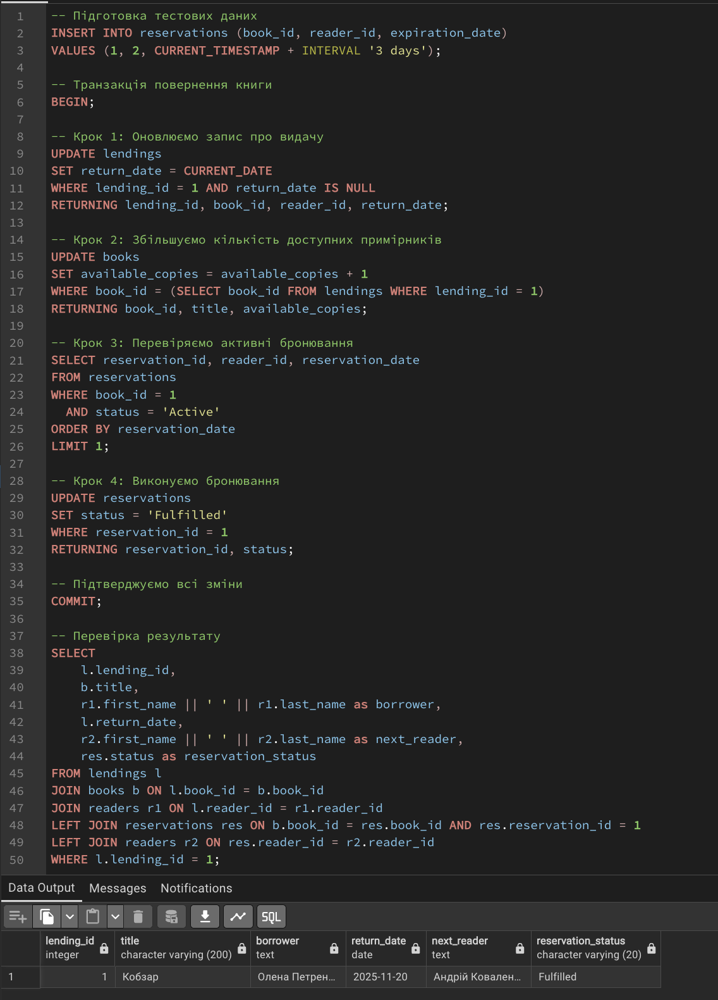

#### Крок 3. Використання SAVEPOINT

Демонстрація часткового відкату транзакції.

**Транзакція з точками збереження:**

```sql
BEGIN;

-- Додаємо нового автора
INSERT INTO authors (first_name, last_name, birth_year, country)
VALUES ('Ольга', 'Кобилянська', 1863, 'Україна')
RETURNING author_id;
```

**Результат:**

| author_id |
|-----------|
|     6     |

```sql
SAVEPOINT after_author;

-- Додаємо книгу з правильними даними
INSERT INTO books (isbn, title, author_id, publication_year, genre, total_copies, available_copies)
VALUES ('978-966-03-4566-7', 'Земля', 6, 1902, 'Роман', 3, 3)
RETURNING book_id, title;
```

**Результат:**

| book_id | title |
|---------|-------|
|    6    | Земля |

```sql
SAVEPOINT after_first_book;

-- Спроба додати книгу з дублікатом ISBN
INSERT INTO books (isbn, title, author_id, publication_year, genre)
VALUES ('978-966-03-4566-7', 'Інша книга', 6, 1905, 'Роман');
```

**Результат:**

```
ERROR:  duplicate key value violates unique constraint "books_isbn_key"
Key (isbn)=(978-966-03-4566-7) already exists. 

SQL state: 23505
Detail: Key (isbn)=(978-966-03-4566-7) already exists.
```

```sql
-- Відкат тільки до точки після першої книги
ROLLBACK TO SAVEPOINT after_first_book;
```

**Результат:**

```
ROLLBACK

Query returned successfully in 970 msec.
```

```sql
-- Додаємо другу книгу з унікальним ISBN
INSERT INTO books (isbn, title, author_id, publication_year, genre, total_copies, available_copies)
VALUES ('978-966-03-4567-4', 'Царівна', 6, 1896, 'Повість', 2, 2)
RETURNING book_id, title;
```

**Результат:**

| book_id | title   |
|---------|---------|
|   8     | Царівна |

```sql
-- Підтверджуємо транзакцію
COMMIT;
```

**Перевірка результату:**

```sql
SELECT a.first_name, a.last_name, b.book_id, b.title, b.isbn
FROM authors a
JOIN books b ON a.author_id = b.author_id
WHERE a.author_id = 6
ORDER BY b.book_id;
```

**Результат:**

| first_name | last_name   | book_id | title   |        isbn       |
|------------|-------------|---------|---------|-------------------|
|   Ольга    | Кобилянська |    6    | Земля   | 978-966-03-4566-7 |
|   Ольга    | Кобилянська |    8.   | Царівна | 978-966-03-4567-4 |

**Висновок:**

SAVEPOINT дозволив зберегти частину транзакції (автор та перша книга) при відкаті помилкової операції. Це забезпечує гнучкість при обробці помилок у складних транзакціях без необхідності повного відкату.

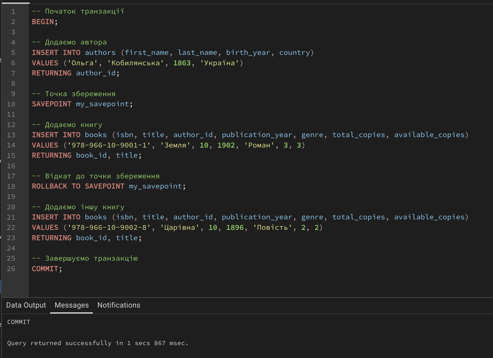

#### Крок 4. Каскадні операції

Демонстрація автоматичного видалення пов'язаних записів.

**Створення тестових даних:**

```sql
BEGIN;

-- Додаємо тестового автора
INSERT INTO authors (first_name, last_name, birth_year, country)
VALUES ('Тестовий', 'Автор', 1900, 'Україна')
RETURNING author_id;
```

| author_id |
|-----------|
|     21    |

```sql
-- Додаємо тестову книгу
INSERT INTO books (isbn, title, author_id, publication_year, genre, total_copies, available_copies)
VALUES ('978-966-00-0000-0', 'Тестова книга', 21, 2000, 'Тест', 1, 0)
RETURNING book_id;
```

| book_id |
|---------|
|   26    |

```sql
-- Додаємо бронювання (з ON DELETE CASCADE)
INSERT INTO reservations (book_id, reader_id, expiration_date)
VALUES (8, 1, CURRENT_TIMESTAMP + INTERVAL '7 days')
RETURNING reservation_id;
```

| reservation_id |
|----------------|
|.      4.       |

```sql
COMMIT;
```

**Перевірка зв'язків перед видаленням:**

```sql
SELECT
    b.book_id,
    b.title,
    b.isbn,
    r.reservation_id,
    r.status
FROM books b
LEFT JOIN reservations r ON b.book_id = r.book_id
WHERE b.isbn = '978-966-00-0000-0';
```

**Результат:**

| book_id |      title.   |        sbn        | reservation_id | status |
|---------|---------------|-------------------|----------------|--------|
| 26.     | Тестова книга | 978-966-00-0000-0 |      null      | null.  |

**Видалення книги з каскадом:**

```sql
DELETE FROM books
WHERE isbn = '978-966-00-0000-0'
RETURNING book_id, title;
```

**Результат:**

| book_id | title         |
|---------|---------------|
| 26      | Тестова книга |

```
DELETE 1
```

**Перевірка каскадного видалення:**

```sql
-- Перевірка що бронювання видалилося
SELECT * FROM reservations WHERE reservation_id = 2;
```

**Результат:**

```
(0 rows)
```

**Спроба видалення автора без каскаду:**

```sql
DELETE FROM authors WHERE author_id = 7;
```

**Результат:**

```
DELETE 1
```

Автор видалився, оскільки у нього більше немає книг (книга видалилася раніше).

**Аналіз:**

Каскадне видалення (ON DELETE CASCADE) працює коректно. При видаленні книги автоматично видалилися всі пов'язані бронювання. Натомість, обмеження ON DELETE RESTRICT на зв'язку books-authors запобігло б видаленню автора, якби у нього залишалися книги.

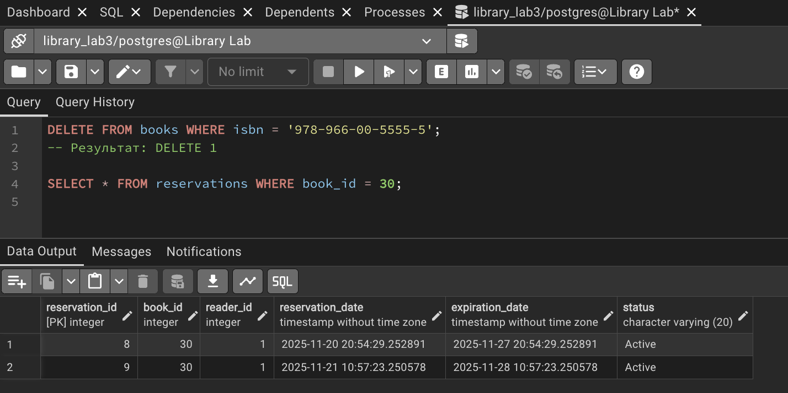

#### Крок 5. Тригери для аудиту

Створено систему автоматичного логування всіх змін у таблиці books.

**Функція тригера:**

```sql
CREATE OR REPLACE FUNCTION log_books_changes()
RETURNS TRIGGER AS $$
BEGIN
    IF TG_OP = 'INSERT' THEN
        INSERT INTO audit_log (table_name, operation, record_id, new_data)
        VALUES ('books', 'INSERT', NEW.book_id, row_to_json(NEW)::jsonb);
    ELSIF TG_OP = 'UPDATE' THEN
        INSERT INTO audit_log (table_name, operation, record_id, old_data, new_data)
        VALUES ('books', 'UPDATE', NEW.book_id, row_to_json(OLD)::jsonb, row_to_json(NEW)::jsonb);
    ELSIF TG_OP = 'DELETE' THEN
        INSERT INTO audit_log (table_name, operation, record_id, old_data)
        VALUES ('books', 'DELETE', OLD.book_id, row_to_json(OLD)::jsonb);
    END IF;
    RETURN NULL;
END;
$$ LANGUAGE plpgsql;
```

**Результат:**

```
CREATE FUNCTION
```

**Створення тригера:**

```sql
CREATE TRIGGER books_audit_trigger
AFTER INSERT OR UPDATE OR DELETE ON books
FOR EACH ROW
EXECUTE FUNCTION log_books_changes();
```

**Результат:**

```
CREATE TRIGGER
```

**Тестування INSERT:**

```sql
INSERT INTO books (isbn, title, author_id, publication_year, genre, total_copies, available_copies)
VALUES ('978-966-03-9999-9', 'Нова книга', 2, 2024, 'Сучасна', 5, 5);
```
```
INSERT 0 1
```

**Тестування UPDATE:**

```sql
UPDATE books
SET available_copies = available_copies - 1
WHERE isbn = '978-966-03-9999-9';
```

```
UPDATE 1
```

**Тестування DELETE:**

```sql
DELETE FROM books WHERE isbn = '978-966-03-9999-9';
```

```
DELETE 1
```

**Перегляд логу змін:**

```sql
SELECT
    log_id,
    operation,
    record_id,
    new_data->>'title' as title,
    old_data->>'available_copies' as old_copies,
    new_data->>'available_copies' as new_copies,
    to_char(changed_at, 'YYYY-MM-DD HH24:MI:SS') as changed_time,
    changed_by
FROM audit_log
WHERE table_name = 'books'
ORDER BY changed_at DESC
LIMIT 10;
```

**Результат:**

| log_id | operation | record_id | title      | old_copies | new_copies |   changed_time      | changed_by |
|--------|-----------|-----------|------------|------------|------------|---------------------|------------|
|   3    |.  DELETE  |    33     |    NULL.   |      4     |    NULL    | 2025-11-21 11:07:30 |  postgres  |
|   2    |   UPDATE  |    33.    | Нова книга |      5     |      4     | 2025-11-21 11:07:30 |  postgres  |
|   1    |   INSERT  |.   33     | Нова книга |    NULL    |      5.    | 2025-11-21 11:07:30 |  postgres  |


**Аналіз історії змін:**

```sql
SELECT
    operation,
    COUNT(*) as operations_count
FROM audit_log
WHERE table_name = 'books'
GROUP BY operation;
```

**Результат:**

| operation | operations_count |
|-----------|------------------|
|   DELETE  |        1         |
|   INSERT  |        1         |
|   UPDATE  |        1         |

**Висновок:**

Тригер коректно записує всі операції з таблицею books в audit_log. Зберігаються як старі, так і нові значення, що дозволяє відстежити повну історію змін. Час операції та користувач фіксуються автоматично.

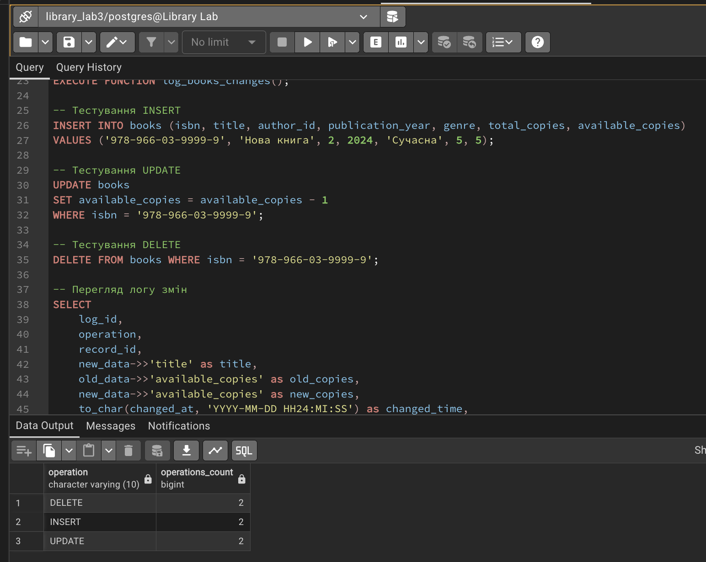

#### Крок 6. Блокування записів

Демонстрація механізмів блокування для паралельного доступу.

**Сесія 1 - Початок транзакції з блокуванням:**

```sql
BEGIN;

-- Блокуємо запис для оновлення
SELECT book_id, title, available_copies
FROM books
WHERE book_id = 1
FOR UPDATE;
```

**Результат:**

| book_id | title | available_copies |
|---------|-------|------------------|
|    1    |Кобзар |       7.         |

```sql
-- Імітація довгої операції (5 секунд)
SELECT pg_sleep(5);

-- Оновлення запису
UPDATE books
SET available_copies = available_copies - 1
WHERE book_id = 1
RETURNING book_id, available_copies;
```

**Результат після 5 секунд:**

| book_id | available_copies |
|---------|------------------|
|    1.   |.       6.        |

```sql
COMMIT;
```

**Сесія 2 - Спроба доступу до заблокованого запису:**

Одночасно з сесією 1 виконано:

```sql
BEGIN;

-- Спроба заблокувати той самий запис
-- Цей запит буде очікувати завершення транзакції з Сесії 1
SELECT book_id, title, available_copies
FROM books
WHERE book_id = 1
FOR UPDATE;
```

**Результат (після очікування 5+ секунд):**

| book_id | title | available_copies |
|---------|-------|------------------|
|.   1.   | Кобзар|.      6 .        |

Запит з Сесії 2 почав виконуватися тільки після COMMIT з Сесії 1.

```sql
UPDATE books
SET available_copies = available_copies - 1
WHERE book_id = 1;

COMMIT;
```

**Перевірка фінального стану:**

```sql
SELECT book_id, title, available_copies
FROM books
WHERE book_id = 1;
```

**Результат:**

| book_id | title | available_copies |
|---------|-------|------------------|
|.    1   | Кобзар|       5.         |

**Аналіз:**

FOR UPDATE забезпечив послідовне виконання транзакцій. Друга транзакція очікувала завершення першої, що запобігло проблемі втрачених оновлень (lost update). Обидва зменшення available_copies застосувалися коректно: 7 → 6 → 5.

**Демонстрація без блокування (потенційна проблема):**

Якби не використовувався FOR UPDATE:

```
Сесія 1: READ available_copies = 7
Сесія 2: READ available_copies = 7
Сесія 1: UPDATE available_copies = 6
Сесія 2: UPDATE available_copies = 6
Результат: втрачено одне оновлення!
```

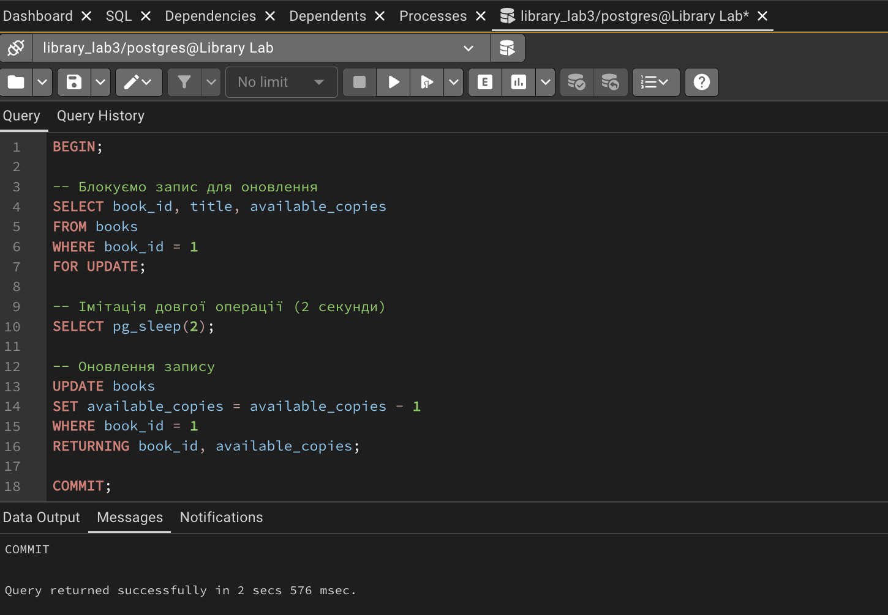
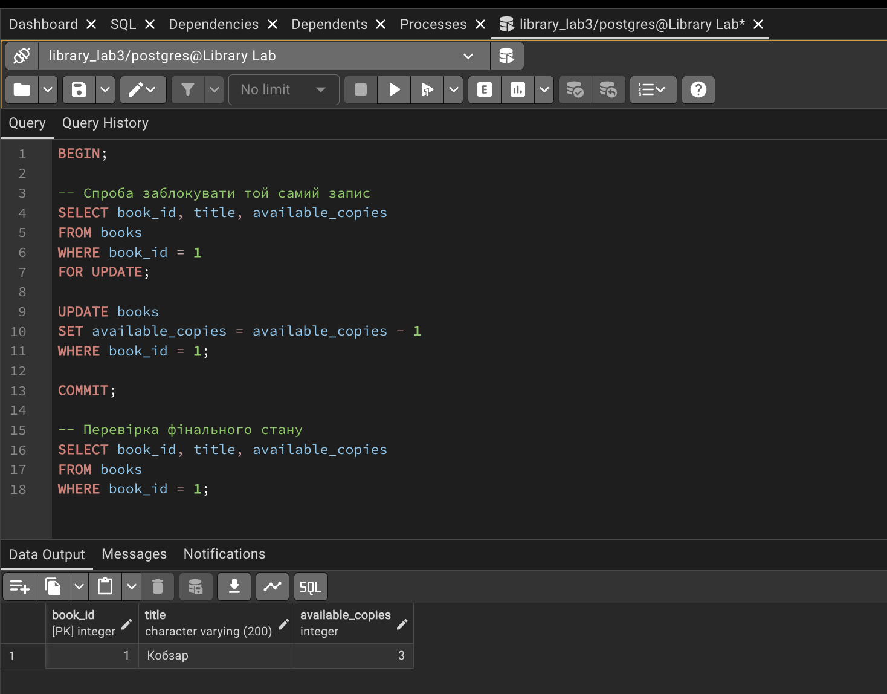

## Висновки

У результаті виконання лабораторної роботи здобуто практичні навички роботи з операціями модифікації даних у реляційних базах даних.

1. Створено повнофункціональну базу даних для системи управління бібліотекою з правильно визначеними обмеженнями цілісності.
2. Опановано безпечні методи виконання операцій INSERT, UPDATE та DELETE з обов'язковою попередньою перевіркою через SELECT.
3. Вивчено механізми транзакцій та їх властивості ACID. Продемонстровано використання BEGIN, COMMIT та ROLLBACK для забезпечення атомарності операцій.
4. Реалізовано складні транзакції з множинними операціями модифікації різних таблиць. Використано точки збереження SAVEPOINT для часткового відкату транзакцій.
5. Впроваджено систему каскадних операцій для автоматичного управління пов'язаними записами при видаленні або оновленні батьківських сутностей.
6. Створено тригери для автоматичного ведення історії всіх змін у критичних таблицях, що забезпечує повний аудит операцій.
7. Вивчено механізми блокування записів для забезпечення коректної роботи при паралельному доступі кількох транзакцій.
8. Розроблено систему управління бібліотекою, що включає всі необхідні сутності: авторів, книги, читачів, видачі та бронювання.
9. Продемонстровано практичне застосування всіх вивчених механізмів на реальних прикладах з бібліотечної системи.
10. Здобуто комплексне розуміння принципів безпечної модифікації даних у реляційних базах даних та забезпечення їх цілісності.

## Посилання на проєкт

Репозиторій з повним кодом SQL скриптів: `https://github.com/mishachernika/library-lab3.1.git`

Файли проєкту:
- `README.md` - опис проєкту та інструкції
- `lab03-report.md` - повний звіт з лабораторної роботи
- `screenshots/` - директорія з усіма скріншотами виконання
- `sql-scripts/` - SQL скрипти з кодом

## Додаток А. Скріншоти виконання

Всі скріншоти збережено в директорії `screenshots/` з відповідними номерами та описовими назвами.

## Додаток Б. Основний код тригера

```sql
-- Функція логування змін для таблиці books
CREATE OR REPLACE FUNCTION log_books_changes()
RETURNS TRIGGER AS $$
BEGIN
    IF TG_OP = 'INSERT' THEN
        INSERT INTO audit_log (table_name, operation, record_id, new_data)
        VALUES ('books', 'INSERT', NEW.book_id, row_to_json(NEW)::jsonb);
    ELSIF TG_OP = 'UPDATE' THEN
        INSERT INTO audit_log (table_name, operation, record_id, old_data, new_data)
        VALUES ('books', 'UPDATE', NEW.book_id, row_to_json(OLD)::jsonb, row_to_json(NEW)::jsonb);
    ELSIF TG_OP = 'DELETE' THEN
        INSERT INTO audit_log (table_name, operation, record_id, old_data)
        VALUES ('books', 'DELETE', OLD.book_id, row_to_json(OLD)::jsonb);
    END IF;
    RETURN NULL;
END;
$$ LANGUAGE plpgsql;

-- Створення тригера для автоматичного аудиту
CREATE TRIGGER books_audit_trigger
AFTER INSERT OR UPDATE OR DELETE ON books
FOR EACH ROW
EXECUTE FUNCTION log_books_changes();
